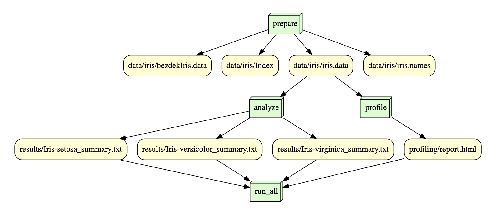

# is477-fall2023-final-project
A reproducible analysis based on IS 477 class materials

## Overview
The purpose of the repository is to reproduce a subset of results from the Iris data set. The Iris dataset includes information on 3 classes of the Iris flower. Each of the 3 classes has 50 instances. Each of the instances contains 4 data points on the flower that was collected using real flowers. These data points are the flower's petal length, petal width, sepal length, and sepal width. Using this information, the goal is to be able to predict the classification of Iris using the data points on the flower. Wihtin our project, we analyzed each of the three classes of Iris' and recorded key summary statistics. Theses summary statistics display the min, max, standard deviation, first quartile, third quartile, and mean of each of the 4 data points. 

## Contributions
Gyury Lee and Josh Sorkin both worked on all sections of the projects together. We collaborated on each part of the project to achieve the end result. 

## Analysis
The analysis section of the project takes into account each of the three types of Iris flowers. Then, the information about each flower is used to create summary statistics. The statistics calculated incliude the mean, min, max, and standard deviation for the sepal length, sepal width, petal length and petal width of each flower. The information also includes the 25% and 75% for each of statistics. 
## Workflow


## Reproducing

First, clone this repository

*  Create a virtual environment (.venv)

* Install the required python packages using command
    ```pip install -r requirements.txt```
    
* Please view the environment log for details regarding software used.

Run the Scripts using command : prepare_data.py using command
```snakemake --core 1 run_all```
Output: Downloads and extracts all data for the Iris dataset from archive.ics.edu and checks integrity of data using SHA-256 hash comparison. Reads the dataset into a dataframe and writes the profiling report to profiling/report.html. Summary statisitcs grouped by each of the three flowers including information on petal width, petal length, sepal width, and sepal length inside of 'results' subdirectory.

## License

We have chosen to use the Creative Commons Attribution 4.0 (CC-BY-4.0)

The Creative Commons Attribution 4.0 (CC-BY-4.0) has the Domain Content, Data. Requires attribution and does not require share-alike.

We have chosen to implement the Creative Commons Attribution 4.0 (CC-BY-4.0) because this data license allows for the use of the datasets for any purpose as long as appropriate credit is provided. This will not limit users from applying and adapting the data in any way which they choose while still ensuring that the original author of the data set is acredited.

We haven chosen to use the MIT software license

The MIT software license is a permissve free and open source license(FOSS). This license provides anyone with the ability to use the software without any restrictions. However, the copyright notice and permission notice are required to be included in all copies or substaintial portions of the software. 

We decided to use the MIT license because it has ver few restrictions on future users of the software. Furthermore, this license is one of the easisiet to apply and adminisiter. Despite the lack of requirements, the MIT license still ensures that the origina author is acredited in future distributions of the work.

## References and Citations

Fisher,R. A.. (1988). Iris. UCI Machine Learning Repository. https://doi.org/10.24432/C56C76.

@misc{misc_iris_53,
  author       = {Fisher,R. A.},
  title        = {{Iris}},
  year         = {1988},
  howpublished = {UCI Machine Learning Repository},
  note         = {{DOI}: https://doi.org/10.24432/C56C76}
}

[](https://doi.org/10.5281/zenodo.10269248)


